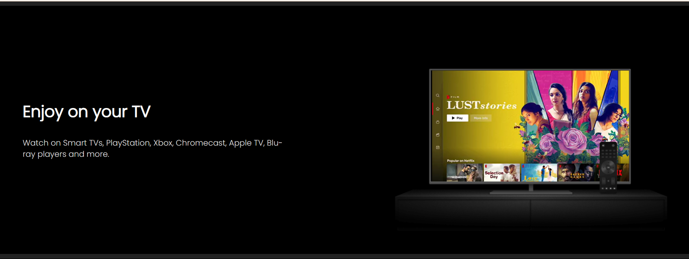
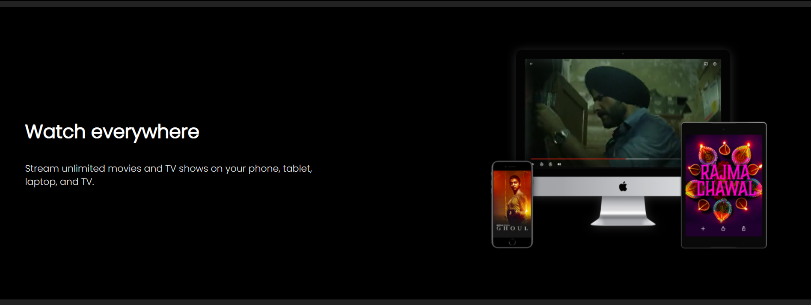

📺 Netflix Clone


This is a responsive Netflix landing page clone built using HTML5 and CSS3. The clone replicates the official Netflix homepage with smooth visuals, clean layout, and an engaging user interface.


🔗 Live Demo

https://github.com/Ishani-yadav/Netflix-Clone.git

📸 Screenshots

## 💻 Desktop View

<p align="center">
  
  
  
  
  
  
</p>

## 📱 Mobile View

<p align="center">
  
  
  
</p>


🔧 Features


✅ Netflix-style hero section with background image and CTA

✅ Responsive navbar with logo and buttons

✅ Email subscription input

✅ Four promotional sections (TV, Mobile, Devices, Kids)

✅ Embedded videos in TV and Devices sections

✅ FAQ accordion-style layout with SVG icons

✅ Clean and responsive footer with useful links


💡 Technologies Used

HTML5

CSS3 (Flexbox + Grid + Media Queries)

Google Fonts

Embedded Video Support

SVG Icons

📁 Folder Structure

```
Netflix-Clone/
├── index.html
├── style.css
├── Images/
│   ├── netflix-logo-0.png
│   ├── tv.png
│   ├── device-pile-in.png
│   ├── image2.jpg
│   ├── mobile-0819.jpg
│   ├── Image1..png
│   └── screenshot-hero.png
├── Videos/
│   ├── video-tv-in-0819.m4v
│   └── video-devices-in.m4v ```


📱 Responsive Design


The layout is fully responsive:

Desktop view with embedded videos

Tablet and mobile optimizations using media queries

Adaptive text and image scaling


✍️ Author
Made with ❤️ by Ishani 


📬 Contact
If you liked this project or want to collaborate, feel free to connect:
GitHub: @Ishani-yadav
LinkedIn: ishani-yadav-7448is


I’m always open to feedback, suggestions, and exciting new opportunities!


