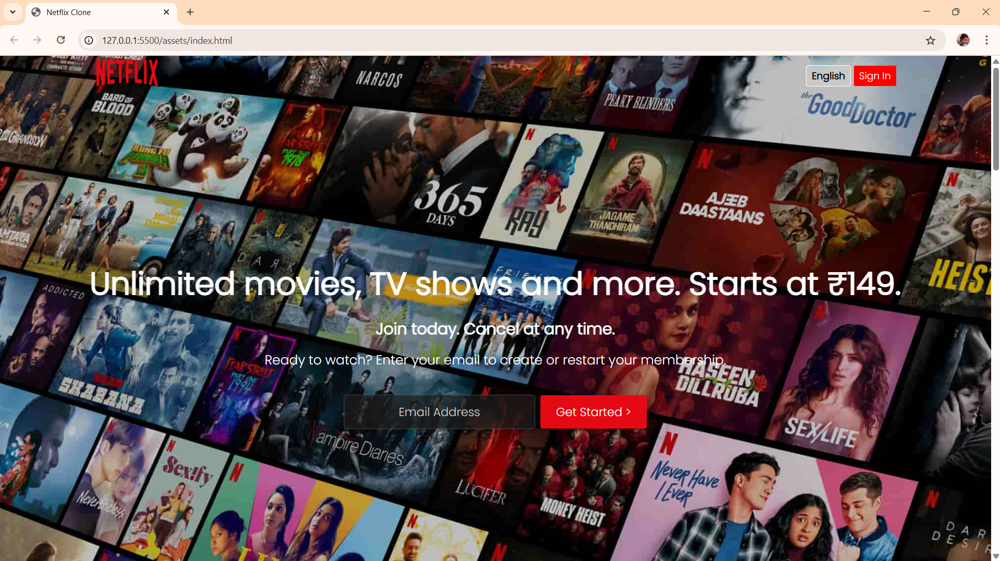
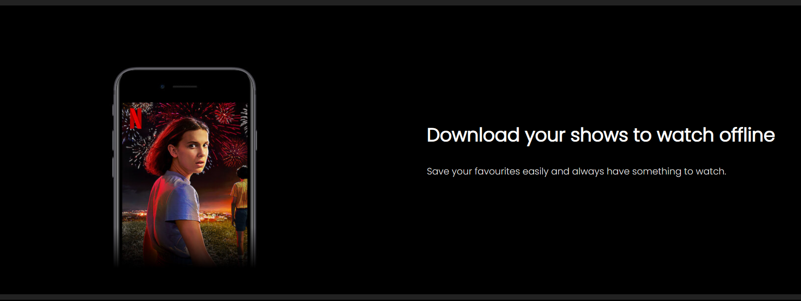
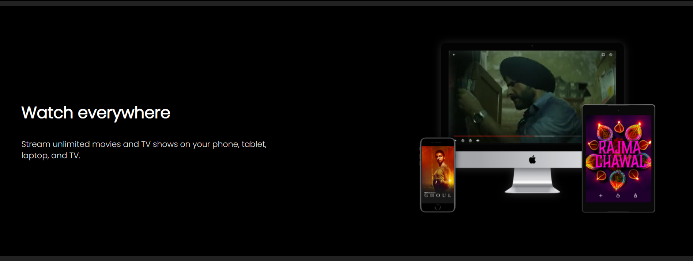
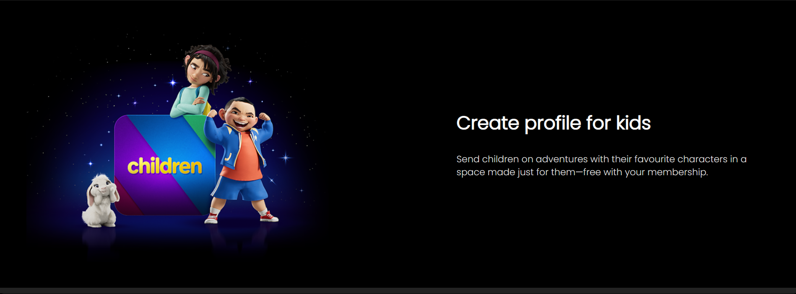
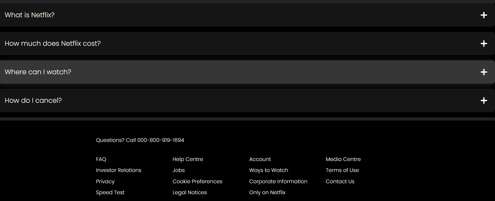
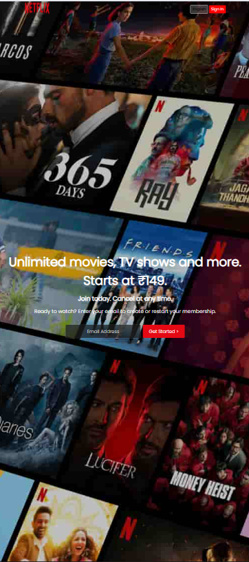
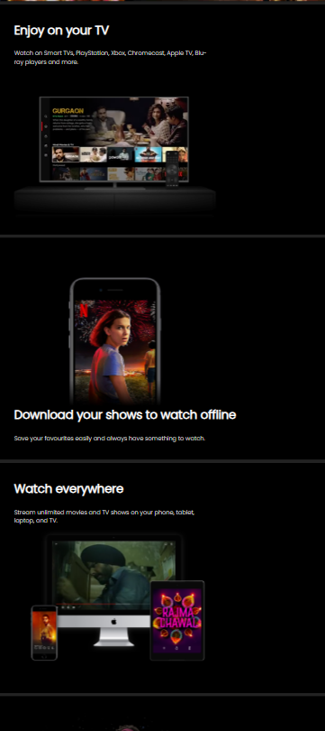
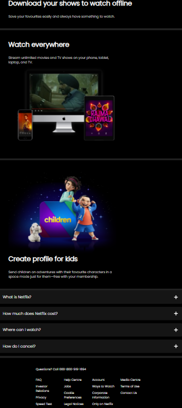

<<<<<<< HEAD
🎬 Netflix Clone
A responsive Netflix homepage clone built using HTML5 and CSS3. This project replicates the look and feel of the official Netflix landing page for both desktop and mobile views.


🚀 Live Demo

[View Live](https://github.com/Ishani-yadav/Netflix-Clone.git)


📸 Screenshots


 🖥️ Desktop View
=======
# Netflix Clone 🎬

A simple and responsive clone of the Netflix homepage built using only HTML5 and CSS3.

## 📸 Screenshots

### 🖥️ Desktop View
>>>>>>> df8aeba (Add README with screenshots)

  
  
  
  
  
  

<<<<<<< HEAD
 📱 Mobile View
=======
### 📱 Mobile View
>>>>>>> df8aeba (Add README with screenshots)

  
  

<<<<<<< HEAD

✨ Features


🔥 Fully responsive design for mobile and desktop

🎨 Pixel-perfect Netflix-inspired UI

💡 Clean and maintainable HTML & CSS structure

🌐 Uses modern HTML5 semantic tags

📱 Mobile-first design approach

🎯 Cross-browser compatibility

🧩 Scalable folder structure

💻 Lightweight and fast performance


🛠️ Technologies Used

- HTML5
- CSS3
- Visual Studio Code

```
Netflix-Clone/
│
├── assets/                             # Main project folder
│   ├── index.html                      # Homepage HTML
│   ├── style.css                       # CSS styles
│   │
│   ├── Images/                         # Image assets used in the project
│   │   ├── device-pile-in
│   │   ├── netflix-logo-0
│   │   └── ...                         # Any other images
│   │
│   ├── Videos/                         # Video files used in UI
│       ├── video-tv-in-0819
│       └── ...                         # Other media files
│
├── Desktop_Images/                    # Screenshots of desktop view
│   ├── desktop1.png
│   ├── desktop2.png
│   └── ...
│
├── Mobile_Images/                     # Screenshots of mobile view
│   ├── mobile1.png
│   ├── mobile2.png
│   └── ...         ```


🧑‍💻 Getting Started

To get a local copy up and running, follow these simple steps:

Clone the repository

git clone( https://github.com/Ishani-yadav/Netflix-Clone.git )
cd Netflix-Clone

Open index.html in your browser

You can also use Live Server in VS Code to preview the project.


📈 Project Status

This project is currently under development.
📌 Upcoming features:

JavaScript integration for interactive components (e.g., sliders, pop-ups)

Dark mode toggle

Improved accessibility


🙏 Acknowledgements
Inspired by the official Netflix UI

Thanks to [Sigma Web Development Course] for HTML/CSS guidance


📬 Contact

If you liked this project or want to collaborate, feel free to connect:
GitHub: @Ishani-yadav
LinkedIn: ishani-yadav-7448is

=======
>>>>>>> df8aeba (Add README with screenshots)
